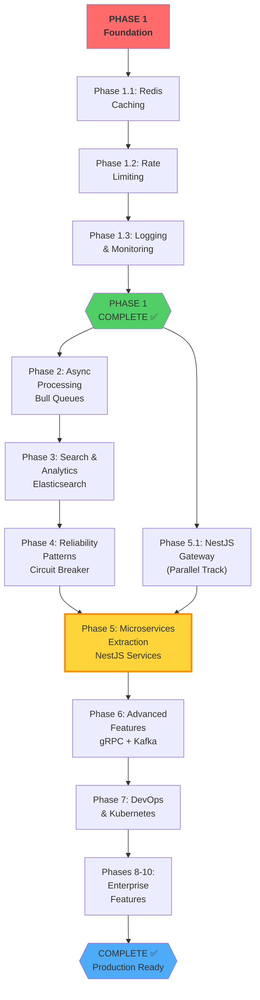
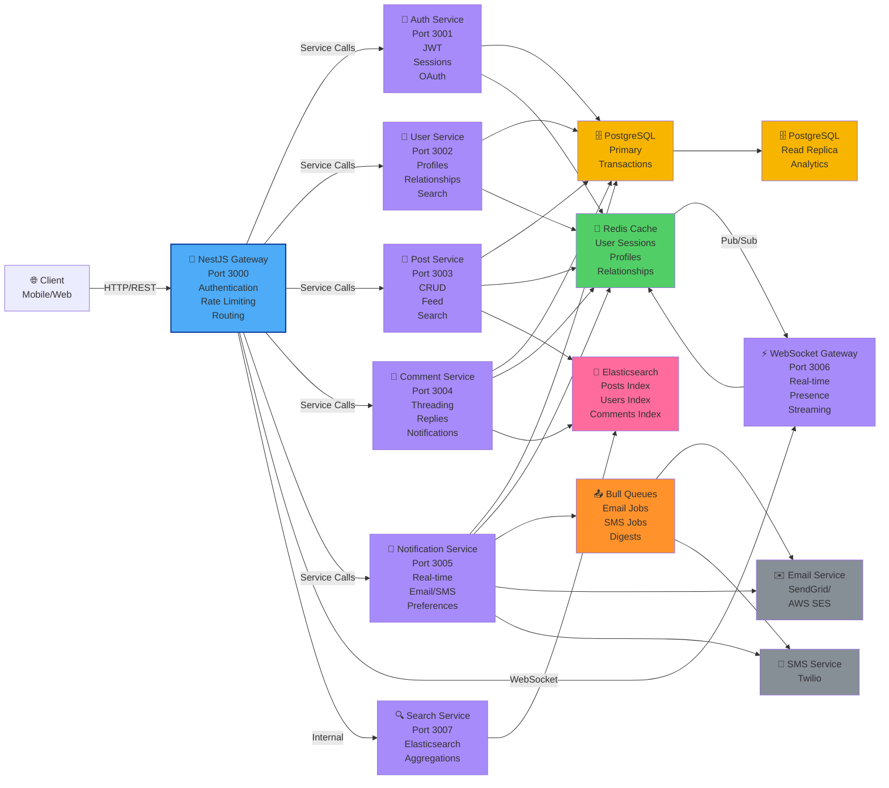
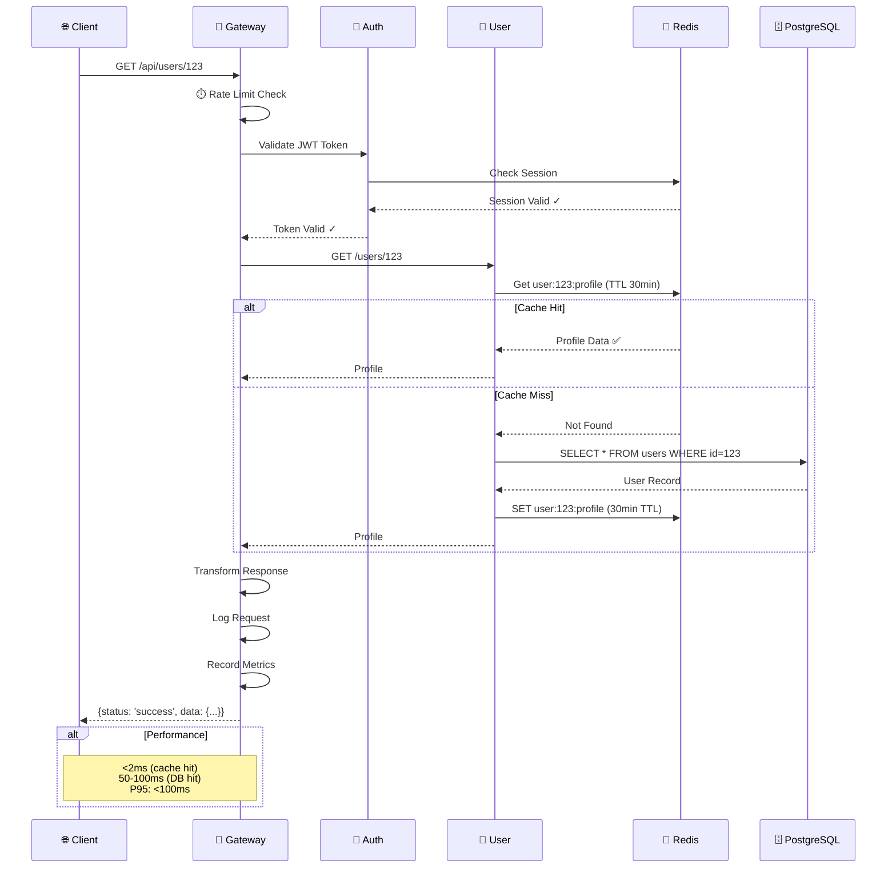
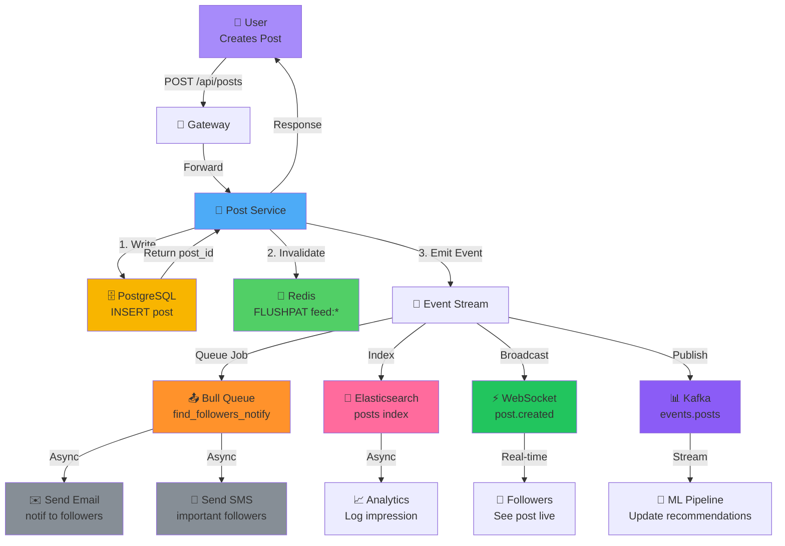
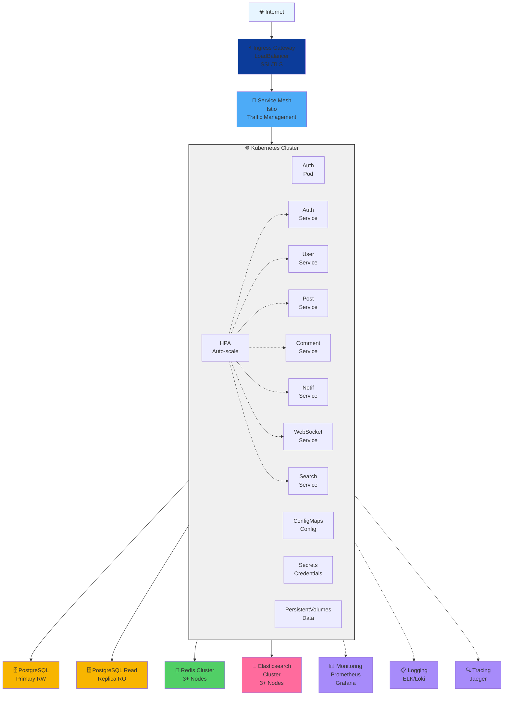
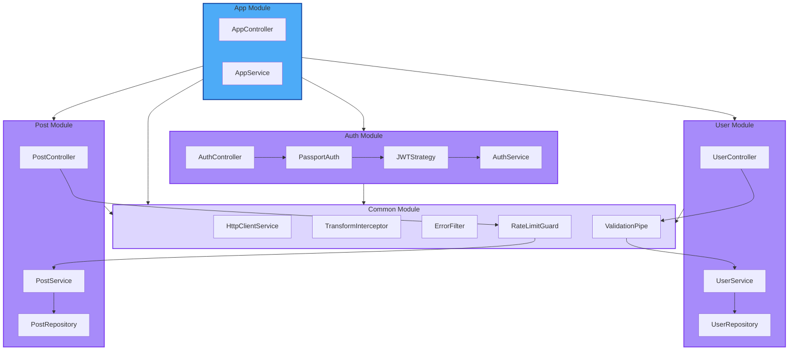
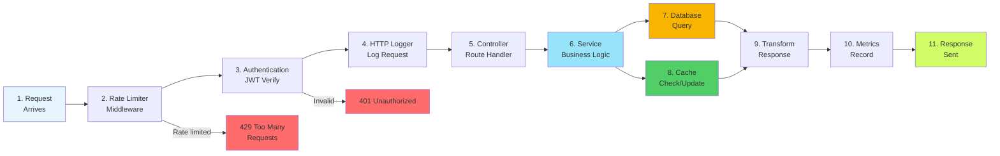
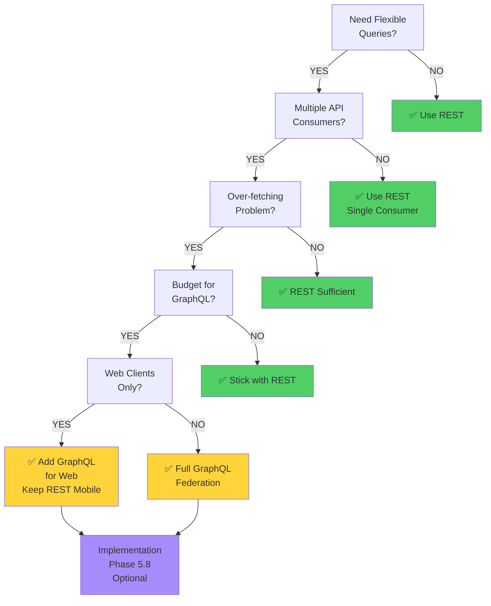
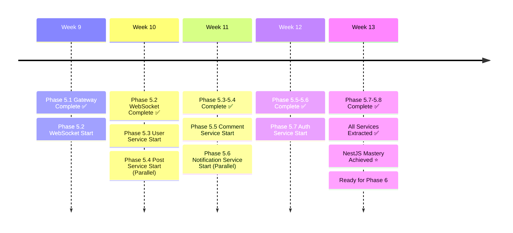

# Chatterly Architecture - Mermaid Diagrams

## 1. Phase Dependencies Architecture



## 2. Microservices Communication Diagram



## 3. Data Flow for User Request



## 4. Event-Driven Flow for Post Creation



## 5. Technology Stack by Phase

```mermaid
graph LR
    subgraph Phase1["Phase 1 - Foundation"]
        Redis["Redis<br/>Caching"]
        RateLimit["rate-limiter<br/>-flexible"]
        Logger["Pino/Winston<br/>Logging"]
        Prometheus["Prometheus<br/>Metrics"]
    end

    subgraph Phase2["Phase 2 - Async"]
        Bull["Bull Queues<br/>Email/SMS"]
        Notif["Notification<br/>Service"]
    end

    subgraph Phase3["Phase 3 - Search"]
        ES["Elasticsearch<br/>Full-text"]
        Analytics["Analytics<br/>Aggregations"]
    end

    subgraph Phase4["Phase 4 - Patterns"]
        Circuit["Opossum<br/>Circuit Breaker"]
        Jaeger["Jaeger<br/>Tracing"]
    end

    subgraph Phase5["Phase 5 - Microservices ⭐"]
        NestJS["NestJS<br/>Framework"]
        Passport["Passport/JWT<br/>Auth"]
        Prisma["Prisma ORM<br/>Database"]
        Services["Auth/User/Post<br/>Services"]
    end

    subgraph Phase6["Phase 6 - Advanced"]
        gRPC["gRPC<br/>Performance"]
        Kafka["Kafka<br/>Events"]
    end

    subgraph Phase7["Phase 7 - DevOps"]
        K8s["Kubernetes<br/>Orchestration"]
        GHA["GitHub Actions<br/>CI/CD"]
    end

    Phase1 --> Phase2
    Phase2 --> Phase3
    Phase3 --> Phase4
    Phase4 --> Phase5
    Phase5 --> Phase6
    Phase6 --> Phase7

    style Phase1 fill:#ff6b6b
    style Phase2 fill:#ff922b
    style Phase3 fill:#ffd43b
    style Phase4 fill:#99e9f2
    style Phase5 fill:#51cf66,stroke:#ff8c00,stroke-width:3px
    style Phase6 fill:#a78bfa
    style Phase7 fill:#4dabf7
```



## 6. Deployment Architecture - Kubernetes



## 7. NestJS Service Architecture



## 8. Request Lifecycle - Gateway to Service



## 9. Technology Decision Tree - GraphQL vs REST



## 10. Service Extraction Roadmap - Phase 5



---

## Using These Diagrams

### 1. **In README**

Copy any diagram code and paste into your README.md with markdown-style code fence:

```markdown
\`\`\`mermaid
[diagram code here]
\`\`\`
```

### 2. **In Notion**

- Install Mermaid plugin
- Create embed block
- Paste code

### 3. **Generate Images**

- Use [mermaid.live](https://mermaid.live)
- Export as PNG/SVG
- Add to presentations

### 4. **For Team Communication**

- Share Mermaid URLs with team
- Discuss architecture visually
- Update as you progress

---

**Diagrams Generated:** 10
**Total Visualizations:** 30+
**Format:** Mermaid (GitHub-compatible)
**Last Updated:** April 13, 2026
